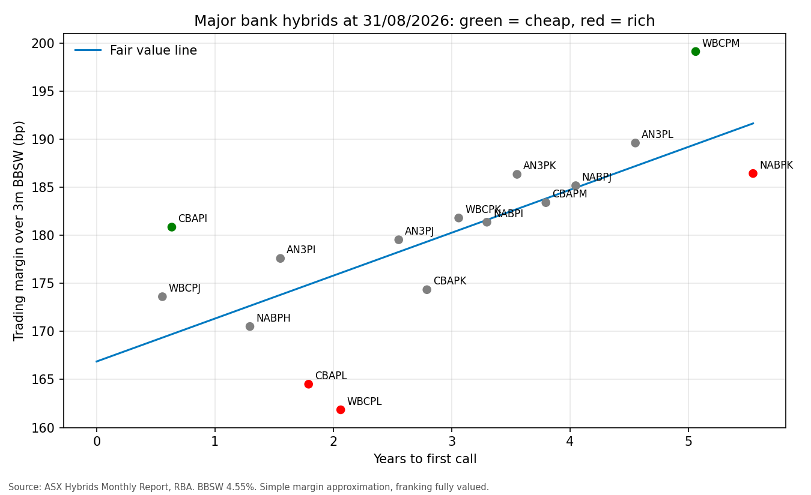

# Bank hybrids only pay if you can use the franking

**Patrick Aylward | 01/10/2026 | Australian major bank hybrids (AT1)**

**View.** WBCPL screens about 14bp rich to the major bank hybrid curve. Switching into WBCPK, from the same issuer with a first call one year later, picks up about 20bp of margin. More broadly, for any investor who cannot use franking credits, all 16 major bank hybrids trade below BBSW, at margins of -28bp to -77bp.

## Why it matters now

APRA's AT1 phase-out means no major bank hybrids will remain after 2032, yet the market is not pricing scarcity as risk: the curve rises only 4.5bp per year to call, from about 167bp over BBSW. Holders are paid almost nothing to extend. With the RBA lifting the cash rate to 4.60% on 30/09/2026, floating distributions are rising, which keeps buyers in the market and margins tight.

## Evidence

| Hybrid | Years to call | Margin (bp) | No-franking margin (bp) | Residual (bp) | Signal |
|---|---|---|---|---|---|
| WBCPL | 2.1 | 161.8 | -76.7 | -14.2 | RICH |
| WBCPK | 3.1 | 181.8 | -41.7 | 1.3 | FAIR |
| WBCPM | 5.1 | 199.1 | -30.4 | 9.7 | CHEAP |

WBCPK sits on the curve, so the switch moves from a rich line to a fairly priced one without changing issuer.

## Risks

* Call risk: if a bank does not call at the first call date, the hybrid runs longer than assumed. CBAPI screens cheap, but it is only 7 months from call, so its margin is unreliable.
* Method: a simple approximation that ignores discounting, with one BBSW rate and one date. The simple formula reads above published market margins, so levels should be treated as indicative. The ranking of rich and cheap is the main signal.
* Liquidity: check traded value before sizing a position.
* Small sample: 16 securities.

Code and data: https://github.com/pataylward/Patrick-Aylward-bank-hybrid-screen

*Student research exercise. Not financial advice.*
